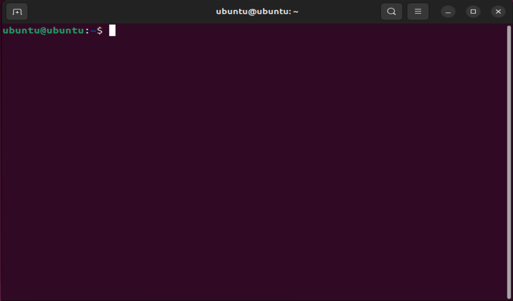
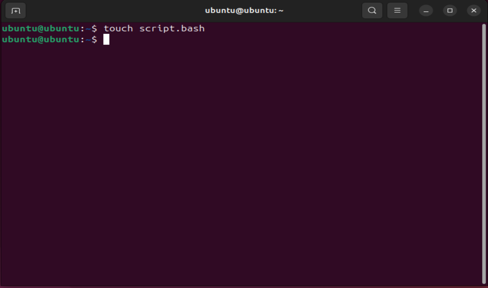
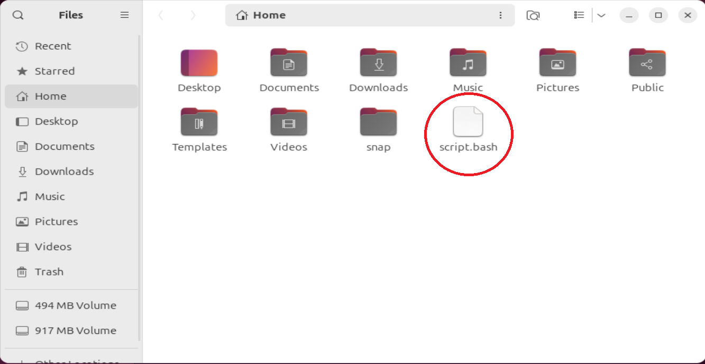
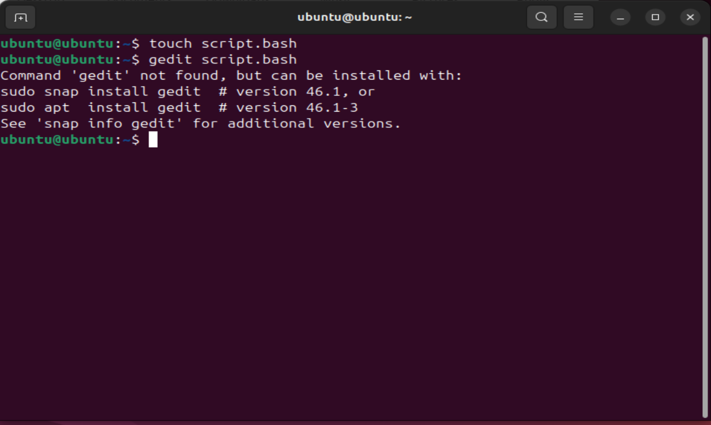
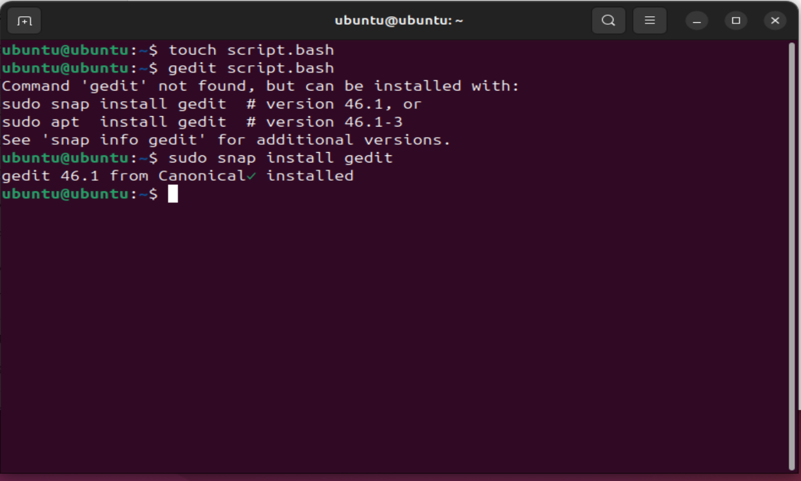
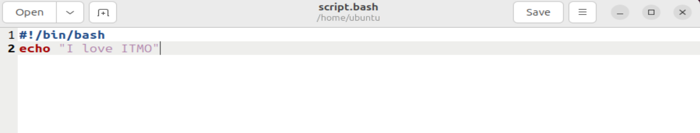
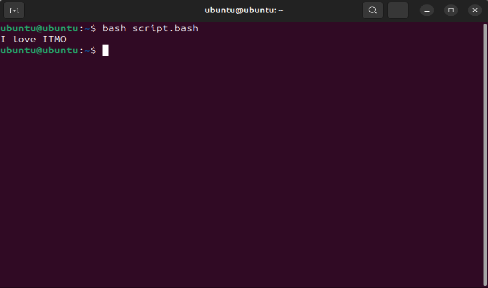

## Лабораторная работа 1

После установки Linux Ubintu можно сразу приступать к выполнению задания.

1. Открываю терминал комбинацией клавиш **Ctrl+Alt+T**:

  

2. Для создания файла использую команду *touch*, "script.bash" - название файла:

  

Файл создан и готов к работе. Чтобы убедиться в этом, достаточно открыть головную директорию:

  

3. Теперь млжно начинать писать код, для этого в терминале пишу *"gedit script.bash"*, но вижу ошибку:

  

Оказалось, у меня не установлен редактор Gedit. Тогда использую команду, которую подсказал мне терминал:

  

Gedit установлен и готов к работе, открываю файл.

4. Написание и тест первого скрипта:

  

  

Отлично! Все работает!

5. 
