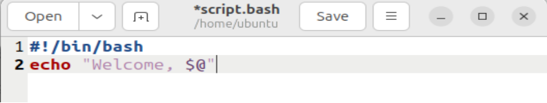

После установки Linux Ubintu можно сразу приступать к выполнению задания.

1. Открываю терминал комбинацией клавиш **Ctrl+Alt+T**:
<p>
  
</p>


2. Для создания файла использую команду *touch*, "script.bash" - название файла:
<p>
  
</p>

Файл создан и готов к работе. Чтобы убедиться в этом, достаточно открыть головную директорию:
<p>
  
</p>

3. Теперь млжно начинать писать код, для этого в терминале пишу *"gedit script.bash"*, но вижу ошибку:
<p>
  
</p>

Оказалось, у меня не установлен редактор Gedit. Тогда использую команду, которую подсказал мне терминал:
<p>
  
</p>

Gedit установлен и готов к работе, открываю файл.

4. Написание и тест первого скрипта:
<p>
  
</p>
<p>
  
</p>
Отлично! Все работает!

5. Теперь создам скрипт, который будет выводить **"Welcome, *x* *y* *z*.."** при запуске в виде
```bash
bash script.bash x y z
```

Для ознакомоения с базовыми командами терминала я воспользовался [этим сайтом](https://habr.com/ru/companies/ruvds/articles/326328/)
<p>
  
</p>
Теперь проверка:
<p>
  
</p>
Как видно, скрипт успешно справляется с любым кол-вом переданных аргуметов.


На этом можно завершить работу. Задание выполнено успешно.
